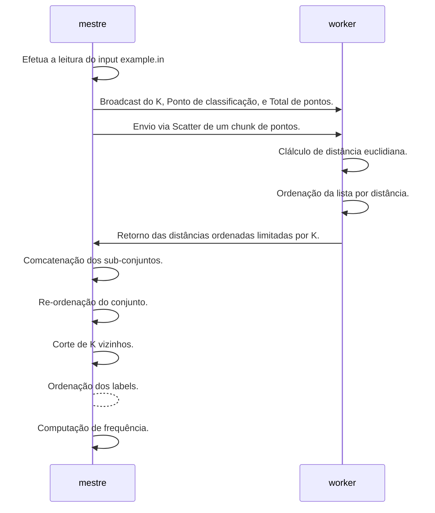

# udesc.ppgca-ppa-knn-mpi

Conversão de programa KNN para uso de MPI e Openmp

## Proposta

### (1) Quais dados devem ser enviados pelo mestre?
R. Optei pela estratégia de Scatter/Gattering, onde envio para todos os processos um sub-conjunto de pontos para computar, e no retorno, aguardo uma lista com as distâncias computadas e pré-ordenadas. No retorno estou recebendo apenas um sub-conjunto do chunk, limitado pelo tamanho de K (Não me interessa os dados mais distantes que K pois são matematicamente irrelevantes).

Além do Scatter, também são enviados os parâmetros de classificação por Broadcast.

### (2) Quais dados devem ser retornados pelos trabalhadores?
R. Uma lista contendo a distância computada e a classe. Na estratégia escolhida são necessárias essas duas informações pois haverá uma nova ordenação e o índice da classe não é confiável neste momento.

### (3) Como o qsort pode ser paralelizado em MPI? Usando apenas OpenMP é suficiente (temos a implementação no moodle)?
R. Sim, em ambas as ferramentas a estratégia de paralelismo poderá ser a mesma, pois é um problema de dividir para conquistar. O ganho real de performance dependerá exclusivamente do tamamhno da carga de trabalho e do ajuste da profundidade da árvore que será usada como critério de particionamento. Vale ressaltar que o uso de MPI possui um custo de comunicação mais elevado, o que só seria uma opção para volumes de dados imensos que justificam utilizar um cluster de computadores. O OOpemMP por outro lado, é a opção mais indicada para aumentar a performance do quick-sort para volumes médios e grandes de dados, mas que ainda seja possível utilizar apenas um computador com memória compartilhada. Na estratégia escolhida optou-se por não paralelizar a etapa de ordenação pois apostou-se na divisão do problema como estratégia, e com isso, o volume a ser ordenado foi consideravelmente reduzido.

### (4) Como avaliar o desempenho?
R. O desempenho dos programas podem ser comparados, num primeiro momento, com o uso da função time e uma mesma amostragem comparando as diferentes versões do programa. Paralela e Sequencial.

### (5) mpi pack pode ajudar

https://www.mcs.anl.gov/research/projects/mpi/mpi-standard/mpi-report-1.1/node62.htm

### (6) Sugestão de dataset

python3 main.py 10000 100 400 60000

Ele vai gerar o example.in com a nova configuração.

## Estratégia de Quebra de input

[0,0,0,1,1,2,2,2,2,2,3,4,5,5,6,7] (distâncias)

[0,0,1,6] (chunk)
[1,4,5,5] (chunk)
[2,2,2,7] (chunk)
[0,2,2,3] (chunk)

para k=2

[0,0,1,4,2,2,0,2] (concatenação dos n chunks)
[0,0,0,1,2,2,2,4] (ordenação)

Resposta 0;
